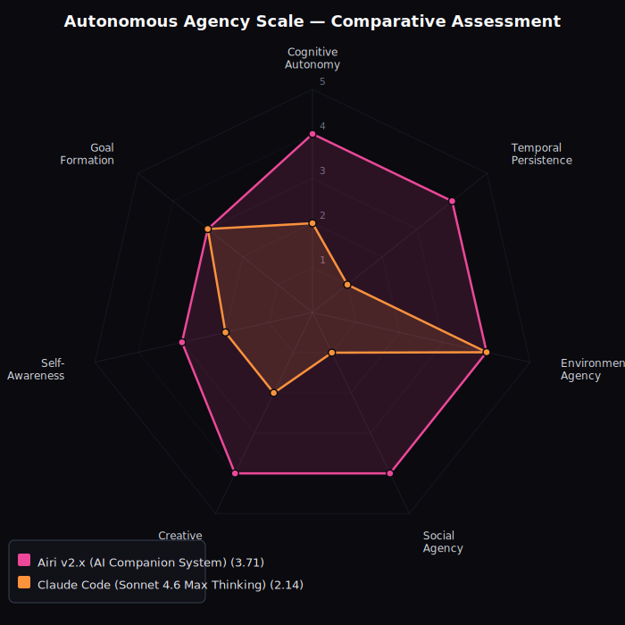

# AAS Comparative Assessments

This chart is auto-generated from all assessment files in this directory.

## Summary

| System | Cognitive Autonomy | Temporal Persistence | Environmental Agency | Social Agency | Creative Agency | Self-Awareness | Goal Formation | Composite |
|--------|-------|-------|-------|-------|-------|-------|-------|-----------|
| [Airi v2.x (AI Companion System)](airi.md) | 4 | 4 | 4 | 4 | 4 | 3 | 3 | **3.71** |
| [Manus 1.6 Max](manus.md) | 2 | 2 | 4 | 1 | 2 | 2 | 3 | **2.29** |
| [Claude Code (Sonnet 4.6 Max Thinking)](claude-code.md) | 2 | 1 | 4 | 1 | 2 | 2 | 3 | **2.14** |
| [ChatGPT (GPT-5.5 / Pro Tier)](chatgpt.md) | 2 | 2 | 2 | 1 | 2 | 1 | 2 | **1.71** |

## Level Reference

| Score | Level | Meaning |
|-------|-------|---------|
| 0 | Dormant | No capability present |
| 1 | Responsive | Reacts to explicit triggers only |
| 2 | Conditioned | Follows pre-set rules/schedules |
| 3 | Contextual | Adapts based on environment/state |
| 4 | Self-Directed | Initiates from internal state |
| 5 | Sovereign | Fully autonomous in this dimension |

---

*Auto-generated by `scripts/generate_chart.py`. Do not edit manually.*
