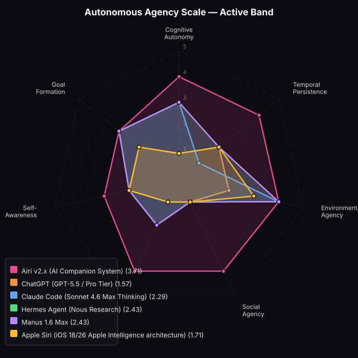
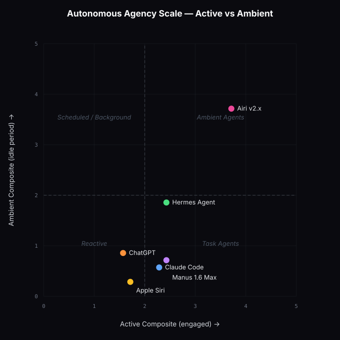

# AAS Comparative Assessments

These charts are auto-generated from all assessment files in this directory.

## Summary

| System | Evidence | Cognitive Autonomy | Temporal Persistence | Environmental Agency | Social Agency | Creative Agency | Self-Awareness | Goal Formation | Active | Ambient |
|--------|----------|-------|-------|-------|-------|-------|-------|-------|--------|---------|
| [Airi v2.x (AI Companion System)](airi.md) | Longitudinal | 4 / 4 | 4 / 4 | 4 / 4 | 4 / 4 | 4 / 4 | 3 / 3 | 3 / 4 | **3.71** | **3.86** |
| [Hermes Agent (Nous Research)](hermes.md) | Docs (provisional) | 3 / 2 | 2 / 2 | 4 / 2 | 1 / 1 | 2 / 2 | 2 / 2 | 3 / 2 | **2.43** | **1.86** |
| [Manus 1.6 Max](manus.md) | Docs (provisional) | 3 / 2 | 2 / 1 | 4 / 0 | 1 / 0 | 2 / 2 | 2 / 0 | 3 / 0 | **2.43** | **0.71** |
| [Claude Code (Sonnet 4.6 Max Thinking)](claude-code.md) | Docs (provisional) | 3 / 2 | 1 / 0 | 4 / 0 | 1 / 0 | 2 / 2 | 2 / 0 | 3 / 0 | **2.29** | **0.57** |
| [Apple Siri (iOS 18/26 Apple Intelligence architecture)](siri.md) | Docs (provisional) | 1 / 0 | 2 / 2 | 3 / 0 | 1 / 0 | 1 / 0 | 2 / 0 | 2 / 0 | **1.71** | **0.29** |
| [ChatGPT (GPT-5.5 / Pro Tier)](chatgpt.md) | Docs (provisional) | 1 / 2 | 2 / 1 | 2 / 0 | 1 / 1 | 1 / 2 | 2 / 0 | 2 / 0 | **1.57** | **0.86** |

Each dimension cell is **Active / Ambient**, the engaged vs idle-period band scores (README §3.4).

## Level Reference

| Score | Level | Meaning |
|-------|-------|---------|
| 0 | Dormant | No capability present |
| 1 | Responsive | Reacts to explicit triggers only |
| 2 | Conditioned | Follows pre-set rules/schedules |
| 3 | Contextual | Adapts based on environment/state |
| 4 | Self-Directed | Initiates from internal state |
| 5 | Sovereign | Fully autonomous in this dimension |

---

*Auto-generated by `scripts/generate_chart.py`. Do not edit manually.*
